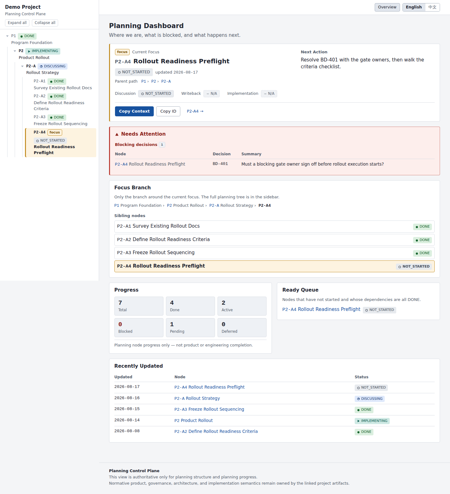
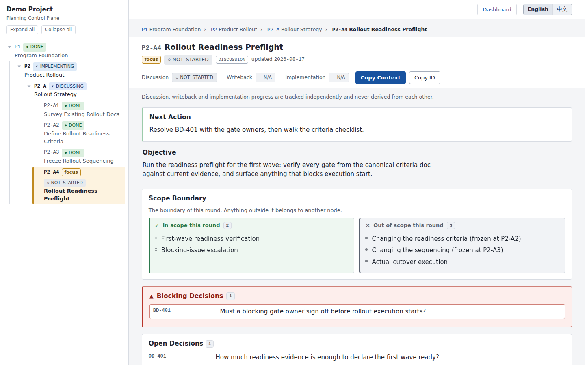

# Planning Control Plane

English | [简体中文](README.zh-CN.md)

**Keep long-running planning context in your repository instead of in chat
transcripts.**

PCP is a command-line tool that stores the planning process of an
AI-assisted project (objectives, decisions, scope, progress) as YAML files
under `.planning/`, versioned with git; `pcp build` renders them into a
fully offline static dashboard.



## Why PCP?

Discussing long-running plans in chat sessions usually runs into three
recurring problems:

- **Context loss**: a new session (or a new week) no longer knows the
  parent constraints and the decisions that were already made.
- **Decision drift**: later discussions silently overturn frozen
  decisions, because nobody re-reads message 40 of a 400-message thread.
- **Scope drift**: the discussion quietly grows past what this round was
  supposed to decide.

A task tracker answers "who is doing what?"; PCP answers "where did the
discussion's context and boundaries go?" Task assignment stays in your
tracker; PCP only manages the planning process.

## The Core Idea

1. **Planning data is source; HTML is a projection.** The Planning Graph
   lives in `.planning/` as plain YAML, committed with your repository.
   `pcp build` renders it into a disposable static site you can delete and
   regenerate at any time.
2. **Decisions cascade down the tree.** Nodes form a planning tree
   (`PROGRAM → PHASE → STRATEGY → …`). Every child node *inherits and
   displays* the frozen decisions and scope boundaries made at its parent,
   so they stay visible instead of being argued over again.
3. **You can always pick up where you left off.** At any moment, exactly
   one node is the current focus. `pcp context` emits a **Context
   Capsule**: a compact, self-contained resume block you paste into a new
   AI session (or send to a teammate) to continue working immediately.
4. **Deterministic and offline.** Same planning source + same PCP version =
   byte-identical output. The generated site references no CDN and no
   remote fonts, and makes no network requests at all; it works when opened
   directly via `file://`.

## Features

- **Planning Graph**: nodes with parent / dependency / blocking / related
  / supersedes edges, validated as a graph (cycle detection included)
- **Current Focus**: the single node the next session should work on,
  highlighted in the dashboard and the tree
- **Frozen / Open / Blocking / Deferred Decisions**: categorized,
  inherited down the tree, never silently lost
- **Scope Boundary**: explicit *in scope / out of scope* lists per node;
  entries declared by ancestors are inherited and displayed, showing where
  the boundary lies
- **Three independent tracks**: discussion, writeback and implementation
  status are stored separately and never derived from each other
- **Context Capsule**: `pcp context <node>` prints a paste-ready resume
  capsule; the node page has a one-click Copy Context button
- **Static dashboard**: deterministic, offline, dark-mode-capable HTML
  with progressive disclosure
- **Bilingual UI**: English and 简体中文, switchable at runtime in the
  browser
- **Authority boundary**: PCP owns planning only; your canonical documents
  stay yours, linked but never replaced
- **Idea layer**: `.planning/ideas/` captures thinking that is not yet
  committed; `pcp ideas` lists and filters it, and a malformed idea file
  degrades to a single validation issue that never blocks the plan

## Installation

Requires Python 3.11+. Recommended installers are pipx or uv (isolated
environments, no PEP 668 externally-managed issues):

```bash
pipx install planning-control-plane     # or: uv tool install planning-control-plane
pcp --help
```

`pip install planning-control-plane` works too (prefer a virtual environment).
Runtime dependencies are just PyYAML and Jinja2.

## Quick Start

In your own repository:

```bash
cd my-project

pcp init          # creates .planning/{project.yaml, roadmap.yaml, nodes/, .gitignore}
```

Create your first planning node, `.planning/nodes/N1.yaml`:

```yaml
id: N1
title: Choose the deployment approach
type: DISCUSSION
status: DISCUSSING

objective: >
  Decide how this service gets deployed, given the constraints we froze
  at the program level.

scope:
  - Deployment tooling
  - Environment topology
out_of_scope:
  - Application refactoring
  - Team staffing

next_action: >
  Compare the two candidate toolchains against the readiness criteria.

discussion_status: IN_PROGRESS
writeback_status: N/A
implementation_status: N/A
last_updated: 2026-08-18
```

Then:

```bash
pcp focus N1      # set the current focus (written to project.yaml)
pcp validate      # structural + consistency checks
pcp build         # generate .planning/dist/
```

Open `.planning/dist/index.html` in a browser (double-clicking works; the
site is fully offline). Continue in the terminal with:

```bash
pcp status        # overview: focus, blockers, progress counts
pcp context       # the resume capsule for the current focus
```

To explore a ready-made example instead, see
[`examples/demo-project`](examples/demo-project): a fictional demo
repository whose seven-node planning tree is ready to `pcp build`
immediately. Its counterpart
[`examples/demo-project-zh`](examples/demo-project-zh) is the same kind of
scenario written in Chinese; the two are independent planning data sets, not
translations of each other (see [Localization](#localization)).

## CLI

| Command | What it does |
| --- | --- |
| `pcp init` | Create the `.planning/` skeleton; never overwrites existing files (`--force` only fills in missing files) |
| `pcp agents` | Print a paste-ready AGENTS.md section teaching AI harnesses this repository's PCP workflow. Read-only; append it with `pcp agents >> AGENTS.md` |
| `pcp validate` | Structural + planning-consistency validation, one issue per line (`ERROR`/`WARNING` + node + rule + reason) |
| `pcp build` | Validate, then deterministically rebuild the HTML output directory |
| `pcp build --check` | Regenerate in a temp directory and compare, to detect stale output (for CI) |
| `pcp status` | Terminal overview: project, current focus, decision counts, progress counts |
| `pcp context [node] [--full]` | Print the session resume capsule (default: the current focus) |
| `pcp focus [node]` | Show or switch the current focus (line-oriented edit of `project.yaml`; comments preserved) |
| `pcp ideas [--status S] [--for NODE [--subtree]]` | List the idea layer, grouped by status. `--for` selects ideas related to a node or its ancestors; `--subtree` switches to the node's subtree. Under `--for` without `--status`, only OPEN and PARKED are listed. The last line prints the next free idea id |
| `pcp graduate IDEA --to NODE [--note TEXT]` | Graduate an idea: write `status: PROMOTED` + `outcome` into the idea file and copy its ref-carrying justification entries into the node's `evidence_sources` (comments preserved; the node must already exist; both files roll back on failure) |

Global option `-p/--project-root PATH` sets the target repository root
(other commands search upward for `.planning/`).

Exit codes: `0` success · `1` business failure (validation errors, unknown
node, stale output) · `2` usage/load error.

## AI Harness Integration

Two assets tell an AI coding harness when to use `pcp`:

1. **AGENTS.md section**: `pcp agents >> AGENTS.md`, once per repository. It
   records two kinds of content: the repository's own rules (document
   naming, the registration convention) and the session workflow.
   AGENTS.md is the open standard most harnesses read natively (Codex,
   Cursor, Gemini CLI, ZCode, …). Claude Code is the exception: it reads
   `CLAUDE.md` only, so bridge it with a `CLAUDE.md` whose sole content
   is `@AGENTS.md`.
2. **Skill**: [`integrations/skills/pcp/SKILL.md`](integrations/skills/pcp/SKILL.md)
   is the manual for the tool itself. One copy, several install locations:

   ```bash
   # user level, shared across harnesses (ZCode scans ~/.agents/skills/)
   mkdir -p ~/.agents/skills/pcp
   curl -fsSL https://raw.githubusercontent.com/LuneHaven/planning-control-plane/main/integrations/skills/pcp/SKILL.md \
     -o ~/.agents/skills/pcp/SKILL.md
   ```

   Claude Code does not scan `~/.agents/`; give it its own copy under
   `~/.claude/skills/pcp/`. To share the skill with a team instead, commit it
   into the repository at `.agents/skills/pcp/SKILL.md`.

   The skill ships with the repository, not with the Python package: it is a
   harness asset, not part of the PCP runtime; runtime adapters and plugins
   remain out of scope (see Roadmap).

This division removes the duplication: repository rules are written only in
`AGENTS.md` and the command manual only in `SKILL.md`, so there is nothing
to keep in sync.

## Idea Layer

Planning nodes are a *post-decision* control system: a node exists because
something was already committed to. The idea layer carries what comes
before that: captured thinking that does not yet qualify for the plan.

```
.planning/ideas/IDEA-0007.yaml     # one file per idea (directly under ideas/, .yaml suffix)
```

```yaml
id: IDEA-0007
title: Add a trend comparison view to the dashboard
status: OPEN                       # OPEN | PARKED | PROMOTED | DISCARDED
detail: One paragraph. Capture asks for no structure.
relates_to: [P2]                   # planning nodes this idea touches
benchmark_sources:                 # what mature products actually do
  - ref: docs/benchmarks/grafana-panels.md
    note: Grafana's time-compare panel shows the demand is stable
  - note: Stripe's month-over-month dashboard      # outside the repo: note only
methodology_sources:               # why it holds, decoupled from any product
  - ref: docs/method/heuristics.md
outcome: ~                         # set when the idea graduates into a node
created: 2026-08-27
last_updated: 2026-08-27
```

Four properties are deliberate:

- **Capture has no gate.** Empty `benchmark_sources` /
  `methodology_sources` are a valid state, and produce no WARNING.
- **A single entry point.** An idea enters the planning graph only by
  graduating: create the node, then point the idea's `outcome.node` at that
  node, by hand or with `pcp graduate IDEA-0007 --to P2-A5`, which also
  copies the idea's ref-carrying justification entries into the node's
  `evidence_sources`. Nodes never reference ideas back, so reading the
  plan never involves unfinished thinking.
- **Ideas cannot break the plan.** A malformed idea file becomes a
  validation issue and is skipped; `pcp status`, `pcp context` and
  `pcp build` keep working, and idea-layer errors never block a build.
- **Ideas are never in a capsule.** `pcp context` carries planning data
  only; `pcp ideas --for <node>` is the separate, deliberate second lookup.

The generated site gets an `ideas.html` page and a sidebar entry, but only
when the project actually has ideas.

One rule runs through the idea layer: the `id` is the identity, the file
name is only an index. Two consequences follow. When a file name does not
match its `id`, `pcp validate` reports the `idea-filename-mismatch`
WARNING (advisory, never blocking); rename the file to fix it. And the last
line of `pcp ideas` prints the next free `IDEA-<NNNN>`, computed from both
loaded ids and the file names on disk, so it never points at a file that
already exists.

## Planning Model

- **Node types** (controlled enum): `PROGRAM`, `PHASE`, `STRATEGY`,
  `DISCUSSION`, `DECISION`, `INVESTIGATION`, `IMPLEMENTATION`, `CLOSURE`.
- **Node status** (planning lifecycle, not a kanban): `NOT_STARTED`,
  `DISCUSSING`, `INVESTIGATING`, `DECIDED`, `WRITEBACK_PENDING`,
  `WRITEBACK_DONE`, `READY`, `IMPLEMENTING`, `BLOCKED`, `DONE`, `DEFERRED`.
- **Three independent tracks** per node: `discussion_status`,
  `writeback_status`, `implementation_status` ∈ `NOT_STARTED`,
  `IN_PROGRESS`, `DONE`, `N/A`. A pure discussion node can be
  Discussion `DONE` + Writeback `DONE` + Implementation `N/A`.
- **Decisions** come in four lists per node:
  - *Frozen*: settled; children inherit them and must not silently overturn them
  - *Open*: identified, not yet settled
  - *Blocking*: unresolved and preventing closure (`DONE` + blocking → validation ERROR)
  - *Deferred*: deliberately postponed
- **Scope Boundary**: `scope` / `out_of_scope` lists per node; entries
  declared by ancestors are inherited and displayed, showing where the
  boundary lies.

## `.planning/` Structure

```
.planning/
├── project.yaml    # project id/name, current_focus, authority roots, ui.locale
├── roadmap.yaml    # optional inline nodes list
├── nodes/          # one YAML file per planning node
└── dist/           # generated site (gitignored, disposable)
```

## Example Node

From `examples/demo-project/.planning/nodes/P2-A4.yaml`:

```yaml
id: P2-A4
title: Rollout Readiness Preflight
type: DISCUSSION
parent: P2-A
status: NOT_STARTED
objective: >
  Run the readiness preflight for the first wave ...
scope:
  - First-wave readiness verification
  - Blocking-issue escalation
out_of_scope:
  - Changing the readiness criteria (frozen at P2-A2)
open_decisions:
  - id: OD-401
    summary: How much readiness evidence is enough to declare the first wave ready?
blocking_decisions:
  - id: BD-401
    summary: Must a blocking gate owner sign off before rollout execution starts?
depends_on: [P2-A3]
canonical_sources:
  - docs/rollout/readiness-criteria.md
evidence_sources:
  - docs/notes/2026-08-15-sequencing-review.md
next_action: >
  Resolve BD-401 with the gate owners, then walk the criteria checklist.
discussion_status: NOT_STARTED
writeback_status: N/A
implementation_status: N/A
last_updated: 2026-08-17
```

## Dashboard & Progressive Disclosure



- The **sidebar** carries the full planning tree, including status, focus
  marker and expand/collapse.
- The **dashboard** answers four questions only: where are we (Current
  Focus), is anything blocked (Needs Attention), what is around the focus
  (Focus Branch), and what can start next (Ready Queue).
- The **node page** is ordered by control-plane priority: sticky header
  (id, status, three tracks, Copy Context) → Next Action → Objective →
  Scope Boundary → decisions (Blocking → Open → Frozen, inherited groups
  collapsed per ancestor) → relations → sources → Resume This Work.
- Details that would obscure the essentials start collapsed (inherited
  frozen decisions, deferred decisions, the full capsule) with counts
  always visible.

## Context Recovery

The **Context Capsule** hands the current state of the planning graph to
your next working session:

```bash
pcp context            # compact capsule for the current focus
pcp context P2-A4      # any node
pcp context --full     # adds ancestor summaries, relations, deferred decisions
```

Paste the capsule into a new AI session as the opening context. It carries
only what a new session needs: the node's objective, inherited frozen
decisions, scope boundaries, open and blocking decisions, sources and
track status, and nothing else. The node page's **Resume This Work**
panel shows the same capsule with a copy button.

## Recommended AI Agent Workflow

```
1. pcp build → open the dashboard, read Current Focus
2. pcp context → paste the capsule into a new agent session
3. Discuss only that branch; record outcomes as decisions in the node YAML
4. Write conclusions that belong in specs back into the canonical docs;
   keep only links in the node
5. Update status / tracks / next_action / last_updated
6. pcp validate → fix ERRORs
7. pcp build (CI: pcp build --check)
8. pcp focus <next-node> → repeat
```

Every artifact of the loop is on disk, so it can be interrupted anywhere
and resumed later.

## Localization

The UI ships in English and 简体中文.

- **Project default**: `ui.locale` in `.planning/project.yaml`:

  ```yaml
  ui:
    locale: zh-CN     # or en (default)
  ```

- **Runtime switch**: the top bar has a `English / 中文` toggle. Switching
  happens instantly in the browser: no rebuild, no refresh, no network. The
  preference is stored in `localStorage` and survives navigation and
  reloads; clearing it falls back to the project default. `project.yaml`
  is never modified.
- **Language never touches data**: node ids, decision ids, stored enum
  values, user-written titles/summaries and the `pcp context` capsule stay
  exactly as written in any locale. Detailed status views show
  `localized label + RAW_ENUM` (e.g. `未开始 NOT_STARTED`), so machine-facing
  values remain searchable.

> The language switch localizes PCP's interface.
> It does not translate your project planning content.
> Planning data remains exactly as authored.

That boundary is why this repository ships two demo projects rather than one:
[`examples/demo-project`](examples/demo-project) holds English planning data
and [`examples/demo-project-zh`](examples/demo-project-zh) holds Chinese
planning data. The Chinese screenshots in
[README.zh-CN.md](README.zh-CN.md) come from the Chinese demo, not from the
English demo viewed through a Chinese UI.

## Architecture

| Layer | Location | Owner |
| --- | --- | --- |
| PCP engine | `src/planning_control_plane/` (this repository) | standalone pip-installed tool |
| Planning data | `<your-repo>/.planning/{project.yaml, roadmap.yaml, nodes/}` | your repository |
| Generated HTML | `<your-repo>/.planning/dist/` | your repository (disposable) |

Modules: `model.py` (enums + data model) · `loader.py` (tolerant YAML
loading) · `graph.py` (tree/graph operations) · `validator.py` (rules) ·
`context.py` (capsule) · `i18n.py` (UI translations, the single source
embedded into each page) · `generator.py` + `templates/` (deterministic
HTML) · `cli.py`.

## Authority Boundary

PCP is authoritative **only** for planning structure and planning progress.
Normative product, governance, architecture and implementation semantics
remain owned by your project's own documents; PCP links to them
(`canonical_sources` / `evidence_sources`) and never copies or judges them.
Every generated page states this in its footer.

## Current Status

**Current release: V0.1.3** is a usable MVP validated through real-project
self-use: the engine, CLI, validator, capsule and bilingual UI all work, and
the automated test suite has 409 tests. Install from
[PyPI](https://pypi.org/project/planning-control-plane/) as shown above.

## Roadmap

Deliberately **not** in scope: multi-user collaboration, server/cloud sync,
database, GitHub/PR integration, AI plugins, automatic summarization or
decision-making, semantic search, Jira/Notion replacement.

Named extension points reserved for later versions (no interfaces yet):
`pcp prompt`, `pcp close`, `pcp reopen`, Git/GitHub adapters, Claude Code /
Codex / ChatGPT adapters, multi-project workspace.

V0.2 candidates (none of them is implemented, and none is a promise):

- close / reopen workflow
- prompt generation
- integration status
- search / filter
- multi-project workspace

## Contributing

Issues and pull requests are welcome. For development:

```bash
pip install -e ".[dev]"
python -m pytest
```

## License

[MIT](LICENSE)
