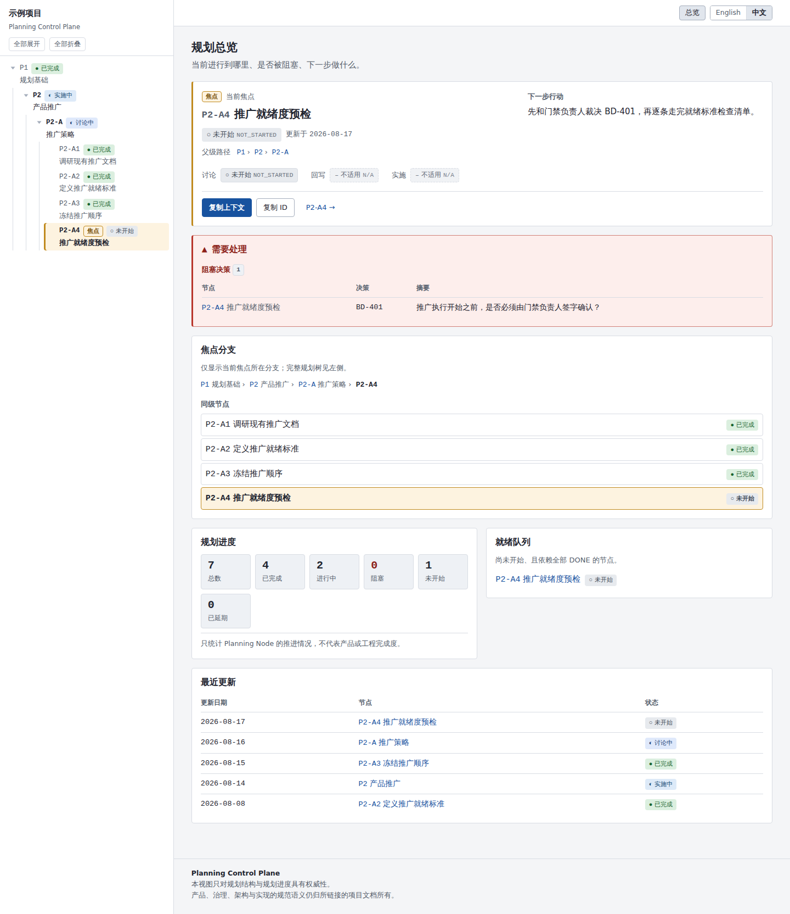
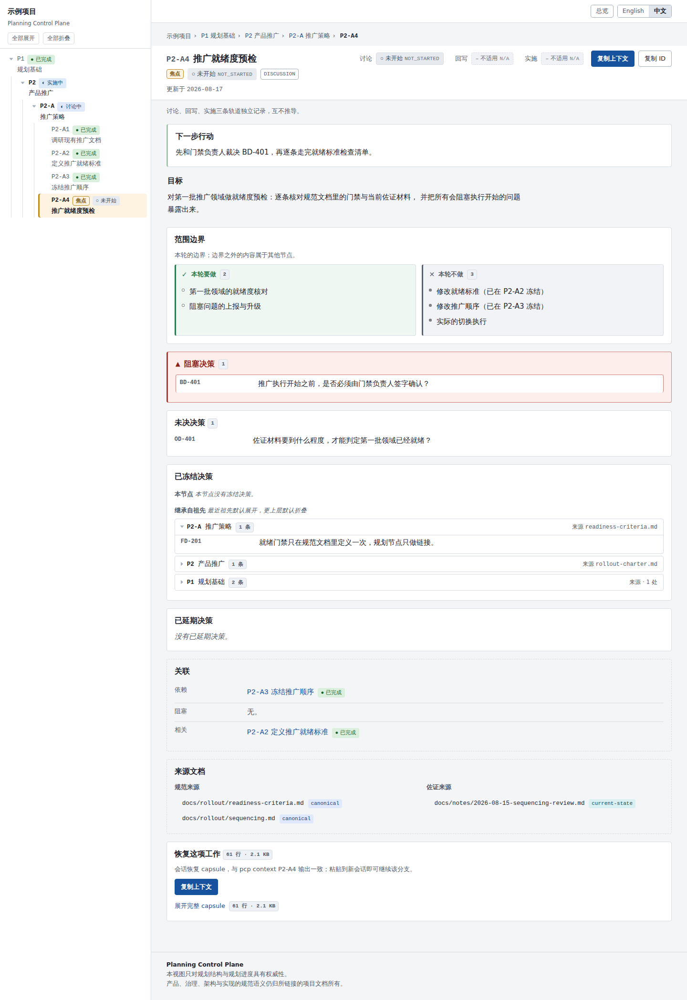
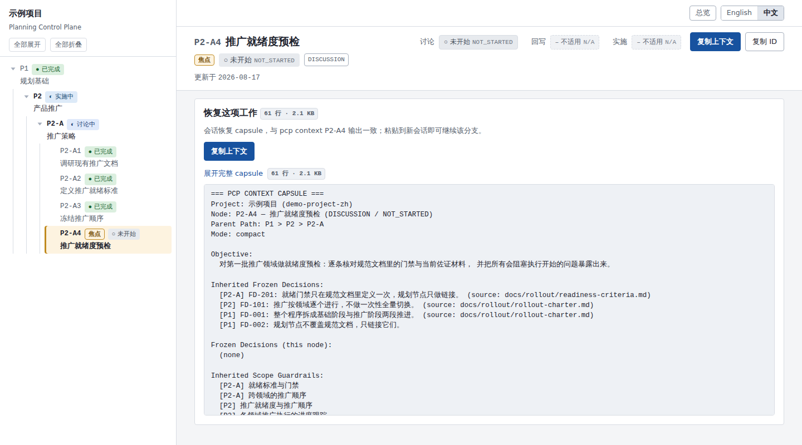

# Planning Control Plane（规划控制平面）

[English](README.md) | 简体中文

**把长期规划的上下文放在仓库里，而不是放在聊天记录里。**



## PCP 解决什么问题

**Planning Control Plane（PCP，规划控制平面）** 是一个仓库原生的长期规划
上下文与进度控制工具：跨分支、跨决策、跨实施阶段、跨 AI 会话地维护规划
过程。它把原本活在——并且逐渐失效于——冗长聊天记录里的规划，变成仓库中
持久的 **Planning Graph（规划图）**，并投影为一份确定性生成、完全离线的
静态 dashboard。

长周期规划在线性会话里以一种可预期的方式失败：

```
长期规划对话 → 上下文丢失 → 决策漂移 → 范围漂移
```

- **上下文丢失**：新会话（或新的一周）不再记得父级约束和已经做出的决策。
- **决策漂移**：后续讨论无意识推翻已冻结的决策——没人会去重读 400 条
  消息里的第 40 条。
- **范围漂移**：讨论范围悄悄扩大，越过了这一轮本该决策的边界。

普通任务追踪器解决不了这些问题：问题不在「谁在做什么」，而在「讨论的
上下文与边界去了哪里」。PCP 管理的是规划过程本身的结构、进度与上下文，
不是任务分派，也不是 Jira / Notion 的替代品。

## 核心思路

1. **规划数据是源，HTML 只是投影。** Planning Graph 以纯 YAML 存放在
   `.planning/`，随仓库提交。`pcp build` 把它渲染成一份可随时删除重建的
   静态站点。
2. **一棵带继承记忆的树。** 节点构成规划树（`PROGRAM → PHASE →
   STRATEGY → …`）。父节点冻结的决策（Frozen Decisions）与范围边界
   （Scope Boundary）会被每个子节点**继承并展示**，始终可见，而不是被
   反复重新争论。
3. **当前焦点（Current Focus）随时可恢复。** 每个时刻只有一个焦点节点。
   `pcp context` 输出 **Context Capsule（上下文胶囊）**——一段紧凑、自
   包含的恢复文本，粘贴到新的 AI 会话（或发给同事）即可从断点继续。
4. **确定性、离线。** 相同规划数据 + 相同 PCP 版本 = 字节级相同的输出。
   生成页面不引用任何 CDN、远程字体或网络请求，直接双击 `file://` 打开
   即可使用。

## 功能

- **Planning Graph（规划图）**——节点带 parent / dependency / blocking /
  related / supersedes 边，按图校验（含环检测）
- **Current Focus（当前焦点）**——下一个会话应推进的唯一节点，dashboard
  与规划树中高亮
- **Frozen / Open / Blocking / Deferred 四类决策**——分类存储、沿树继承、
  不会静默丢失
- **Scope Boundary（范围边界）**——每个节点显式声明本轮要做 / 本轮不做，
  祖先条目作为护栏继承展示
- **三条独立轨道**——讨论、回写、实施三个状态分别存储，互不推导
- **Context Capsule**——`pcp context <node>` 输出可直接粘贴的恢复文本；
  节点页有一键「复制上下文」
- **静态 dashboard**——确定性、离线、支持深色模式的 HTML，按需分层展开
- **中英双语界面**——English 与 简体中文，浏览器内运行时切换
- **仓库原生的权威边界**——PCP 只拥有规划本身；它链接你的规范文档，
  从不取代它们

## 安装

PCP 尚未发布到 PyPI，请从源码安装（需要 Python 3.11+）。许多发行版的
系统 Python 受 PEP 668 externally-managed 限制，建议使用虚拟环境：

```bash
git clone <仓库地址> planning-control-plane   # 或下载并解压源码
cd planning-control-plane
python3 -m venv .venv
source .venv/bin/activate        # Windows PowerShell: .venv\Scripts\activate
pip install -e .
pcp --help
```

运行时依赖只有 PyYAML 和 Jinja2。

## 快速开始

在你自己的仓库里：

```bash
cd my-project

pcp init          # 生成 .planning/{project.yaml, roadmap.yaml, nodes/, .gitignore}
```

创建第一个规划节点 `.planning/nodes/N1.yaml`：

```yaml
id: N1
title: 确定部署方案
type: DISCUSSION
status: DISCUSSING

objective: >
  在程序级已冻结的约束下，决定本服务的部署方式。

scope:
  - 部署工具链
  - 环境拓扑
out_of_scope:
  - 应用重构
  - 团队人员安排

next_action: >
  对照就绪标准比较两个候选工具链。

discussion_status: IN_PROGRESS
writeback_status: N/A
implementation_status: N/A
last_updated: 2026-08-18
```

然后：

```bash
pcp focus N1      # 设定当前焦点（写入 project.yaml）
pcp validate      # 结构 + 一致性校验
pcp build         # 生成 .planning/dist/
```

用浏览器打开 `.planning/dist/index.html`——直接双击即可，站点完全离线。
继续在终端里：

```bash
pcp status        # 概览：焦点、阻塞、进度计数
pcp context       # 当前焦点的恢复 capsule
```

如果想直接体验现成示例，看
[`examples/demo-project-zh`](examples/demo-project-zh)——一个合成仓库，
含七个节点的中文规划树，可立即 `pcp build`；
[`examples/demo-project`](examples/demo-project) 是同类场景的英文版本。
两者是各自独立的规划数据，不是彼此的翻译（原因见
[界面语言](#界面语言)）。

## CLI

| 命令 | 作用 |
| --- | --- |
| `pcp init` | 生成 `.planning/` 骨架；绝不覆盖已有文件（`--force` 只补建缺失文件） |
| `pcp validate` | 结构 + 规划一致性校验，逐行输出（`ERROR`/`WARNING` + 节点 + 规则 + 原因） |
| `pcp build` | 先校验，再确定性重建 HTML 输出目录 |
| `pcp build --check` | 在临时目录重新生成并比对——CI 中的 drift 检测 |
| `pcp status` | 终端概览：项目、当前焦点、决策计数、进度计数 |
| `pcp context [node] [--full]` | 输出会话恢复 capsule（默认当前焦点） |
| `pcp focus [node]` | 查看或切换当前焦点（对 `project.yaml` 做行级编辑，保留注释） |

全局参数：`-p/--project-root PATH`——目标仓库根目录（其余命令从该目录
向上查找 `.planning/`）。

退出码：`0` 成功 · `1` 业务失败（校验错误、未知节点、drift）·
`2` 用法/加载错误。

## 规划模型

- **节点类型**（受控枚举）：`PROGRAM`、`PHASE`、`STRATEGY`、
  `DISCUSSION`、`DECISION`、`INVESTIGATION`、`IMPLEMENTATION`、`CLOSURE`。
- **节点状态**（规划生命周期，不是看板）：`NOT_STARTED`、`DISCUSSING`、
  `INVESTIGATING`、`DECIDED`、`WRITEBACK_PENDING`、`WRITEBACK_DONE`、
  `READY`、`IMPLEMENTING`、`BLOCKED`、`DONE`、`DEFERRED`。
- **三条独立轨道**——`discussion_status` / `writeback_status` /
  `implementation_status` ∈ `NOT_STARTED`、`IN_PROGRESS`、`DONE`、`N/A`。
  一个纯讨论节点可以是 Discussion `DONE` + Writeback `DONE` +
  Implementation `N/A`。
- **决策分四类**：
  - *Frozen（已冻结）*——已定；子节点继承，不应无意识推翻
  - *Open（未决）*——已识别、未定
  - *Blocking（阻塞）*——未解决且阻止收尾（`DONE` + blocking → 校验 ERROR）
  - *Deferred（已延期）*——明确推迟
- **范围边界**——每节点 `scope` / `out_of_scope` 清单；祖先条目作为
  guardrails 继承展示。

## `.planning/` 结构

```
.planning/
├── project.yaml    # 项目 id/名称、current_focus、authority roots、ui.locale
├── roadmap.yaml    # 可选的内联节点清单
├── nodes/          # 每个规划节点一个 YAML 文件
└── dist/           # 生成站点（gitignore，可随时丢弃重建）
```

## 节点示例

摘自 `examples/demo-project-zh/.planning/nodes/P2-A4.yaml`：

```yaml
id: P2-A4
title: 推广就绪度预检
type: DISCUSSION
parent: P2-A
status: NOT_STARTED
objective: >
  对第一批推广领域做就绪度预检 ...
scope:
  - 第一批领域的就绪度核对
  - 阻塞问题的上报与升级
out_of_scope:
  - 修改就绪标准（已在 P2-A2 冻结）
open_decisions:
  - id: OD-401
    summary: 佐证材料要到什么程度，才能判定第一批领域已经就绪？
blocking_decisions:
  - id: BD-401
    summary: 推广执行开始之前，是否必须由门禁负责人签字确认？
depends_on: [P2-A3]
canonical_sources:
  - docs/rollout/readiness-criteria.md
evidence_sources:
  - docs/notes/2026-08-15-sequencing-review.md
next_action: >
  先和门禁负责人裁决 BD-401，再逐条走完就绪标准检查清单。
discussion_status: NOT_STARTED
writeback_status: N/A
implementation_status: N/A
last_updated: 2026-08-17
```

## Dashboard 与分层展开



- **侧栏**承载完整规划树——状态、焦点标记、展开/折叠。
- **Dashboard** 只回答四个问题：现在在哪（当前焦点）、是否被阻塞（需要
  处理）、焦点周围是什么（焦点分支）、接下来可以开始什么（就绪队列）。
- **节点页**按控制面优先级排列：sticky header（节点 ID、状态、三轨、
  复制上下文）→ 下一步行动 → 目标 → 范围边界 → 决策（阻塞 → 未决 →
  已冻结，继承分组按祖先折叠）→ 关联 → 来源 → 恢复这项工作。
- 会淹没要点的细节默认折叠（继承的已冻结决策、已延期决策、完整
  capsule），条数始终可见。

## 上下文恢复

**Context Capsule** 是规划图与下一个工作会话之间的桥：

```bash
pcp context            # 当前焦点的紧凑 capsule
pcp context P2-A4      # 任意节点
pcp context --full     # 追加祖先摘要、关联节点、已延期决策
```

把 capsule 粘贴到新的 AI 会话作为开场上下文。它携带该节点的目标、继承的
已冻结决策、范围边界、未决与阻塞决策、来源与三轨状态——新会话需要的
一切，以及它不该看到的之外的任何东西都不会出现。节点页的「恢复这项
工作」面板展示同一份 capsule，并带复制按钮。



## 推荐的 AI Agent 工作流

```
1. pcp build → 打开 dashboard，阅读当前焦点
2. pcp context → 把 capsule 粘贴到新的 agent 会话
3. 只讨论该分支；讨论结论作为决策写进节点 YAML
4. 属于规格的结论回写到规范文档，节点里只保留链接
5. 更新 status / 三轨 / next_action / last_updated
6. pcp validate → 修复全部 ERROR
7. pcp build（CI：pcp build --check）
8. pcp focus <下一个节点> → 循环
```

循环的每一步产物都落盘，因此可在任意位置中断，之后随时恢复。

## 界面语言

界面支持 English 与 简体中文。

- **项目默认语言**——`.planning/project.yaml` 的 `ui.locale`：

  ```yaml
  ui:
    locale: zh-CN     # 或 en（默认）
  ```

- **运行时切换**——顶栏有 `English / 中文` 切换控件。切换在浏览器内即时
  完成：不重新 build、不刷新、不联网。偏好保存在 `localStorage`，跨页面
  跳转与刷新后仍然有效；清除后回落到项目默认。`project.yaml` 永不被修改。
- **语言不碰数据**——节点 ID、决策 ID、存储的枚举值、用户撰写的标题与
  摘要、`pcp context` capsule 在任何语言下都保持原值。详细状态视图显示
  「本地化文案 + 原始枚举」（如 `未开始 NOT_STARTED`），机器可读的值始终
  可搜索。

> 语言切换只负责切换 PCP 的界面语言，
> 不会自动翻译项目自身的规划内容。
> 规划数据始终保持作者原文。

正因为存在这条边界，本仓库提供两份示例项目而不是一份：
[`examples/demo-project`](examples/demo-project) 存放英文规划数据，
[`examples/demo-project-zh`](examples/demo-project-zh) 存放中文规划数据。
本文档的中文截图来自中文示例项目，而不是把英文示例切到中文界面得到的。

## 架构

| 层 | 位置 | 归属 |
| --- | --- | --- |
| PCP engine | `src/planning_control_plane/`（本仓库） | 独立的 pip 安装工具 |
| 规划数据 | `<你的仓库>/.planning/{project.yaml, roadmap.yaml, nodes/}` | 你的仓库 |
| 生成的 HTML | `<你的仓库>/.planning/dist/` | 一次性投影 |

模块：`model.py`（枚举与数据模型）· `loader.py`（容错 YAML 加载）·
`graph.py`（树/图操作）· `validator.py`（校验规则）· `context.py`
（capsule）· `i18n.py`（界面翻译表——单一来源，逐页内嵌）·
`generator.py` + `templates/`（确定性 HTML 生成）· `cli.py`。

## 权威边界（Authority Boundary）

PCP 只对**规划结构与规划进度**具有权威性。产品、治理、架构与实现的
规范语义仍归你项目自己的文档所有；PCP 只链接它们
（`canonical_sources` / `evidence_sources`），不复制、不判定其内容。每张
生成页面都在页脚声明这一点。

## 当前状态

**当前版本：V0.1.2。** V0.1.2 已达到可用 MVP 阶段，并完成真实项目
Dogfood 验证：引擎、CLI、校验器、capsule 与双语界面均已可用，并有自动化
测试覆盖（229 个测试）。PCP **尚未发布到 PyPI**——请按上文从源码安装。
公开仓库也尚未建立。

## 路线图

明确**不做**：多人协作、服务器/云同步、数据库、GitHub/PR 集成、AI
插件、自动摘要或自动决策、语义搜索、Jira/Notion 替代。

已命名但未实现的扩展点（暂无接口）：`pcp prompt`、`pcp close`、
`pcp reopen`、Git/GitHub 适配器、Claude Code / Codex / ChatGPT 适配器、
多项目工作区。

V0.2 候选项——**候选，未承诺**；下列条目都尚未实现，也都不构成承诺：

- close / reopen 工作流
- prompt 生成
- 集成状态
- 搜索 / 过滤
- 多项目工作区

## 参与贡献

公开仓库公布后，欢迎 issue 与 pull request。开发环境：

```bash
pip install -e ".[dev]"
python -m pytest
```

## 许可证

[MIT](LICENSE)
